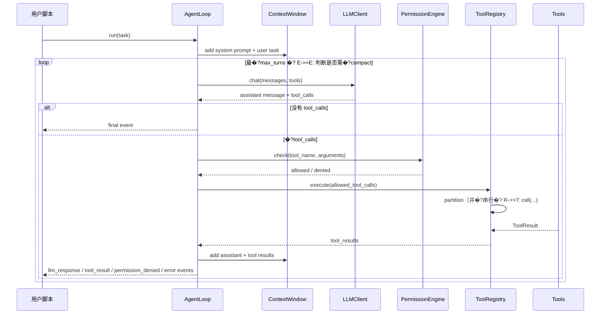
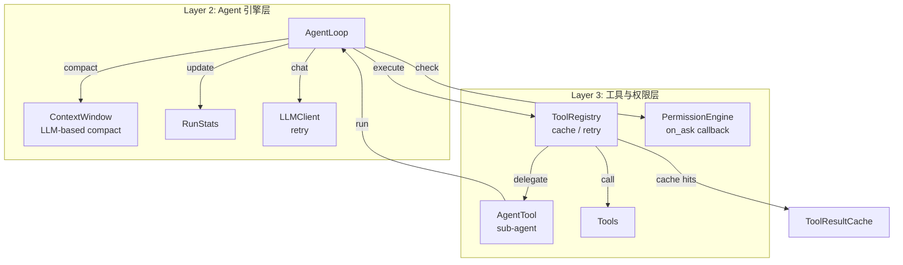
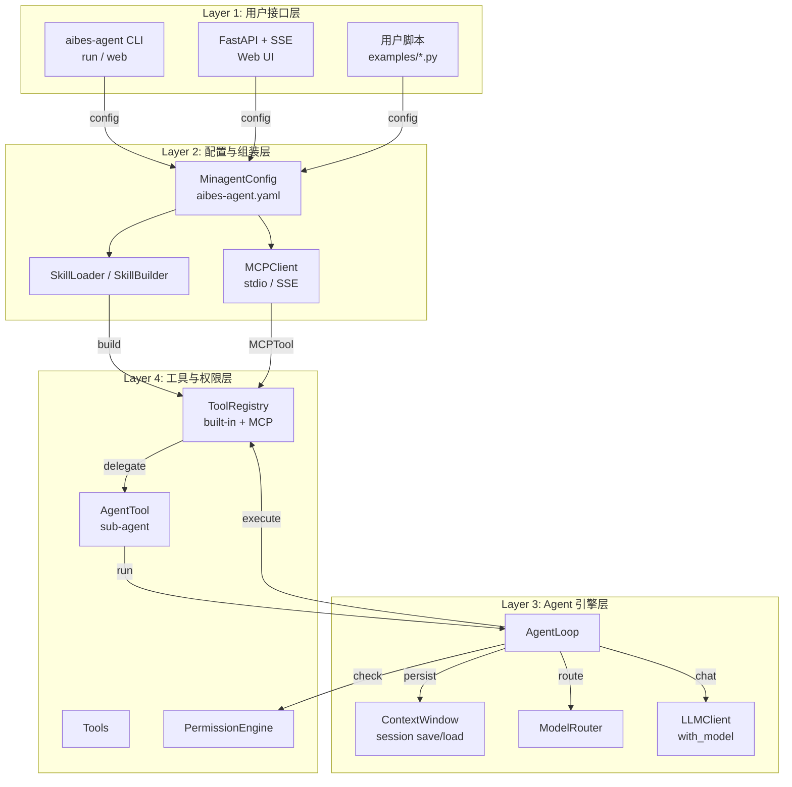

# aibes-agent 架构设计文档

> **版本**: 0.4.0  
> **最后更新**: 2026-07-02  
> **关联文档**: [模块设计](./MODULE_DESIGN.md)、[版本演进计划](./ROADMAP.md)

---

## 1. 设计目标与定�?
`aibes-agent` 是一个受 [Claude Code](https://code.claude.com/docs) 启发�?*最�?Python Agent 框架**。它的核心目标不是替�?Claude Code，而是�?
- **快速验�?Agent 思路**：几小时内跑通“自然语言任务 �?工具调用 �?结果输出”的闭环�?- **领域专用 Agent 的起�?*：例如钻井工程代码分析、装备保障智能分析等垂直场景�?- **学习与实�?*：帮助开发者理�?Agent Loop、工具编排、上下文管理、权限控制等核心概念�?
### 1.1 边界

| 在范围内 | 不在范围内（当前版本�?|
|---------|---------------------|
| 基于 OpenAI 兼容 API �?function calling | 原生 IDE 插件 / GUI |
| 文件、Shell、搜索、任务列表等基础工具 | 完整�?MCP 生�?|
| 异步 Agent Loop + 事件�?| 生产级沙箱执�?|
| 基础权限规则引擎 | 基于 LLM 的自动风险分类器 |

---

## 2. 核心设计原则

设计 `aibes-agent` 时参考了 Claude Code 的源码架构分析（�?`docs/references/05_Claude_Code_源码架构分析.md`）以�?Agentic AI 的通用模式（见 `docs/references/20260519_Agentic_AI_架构设计深度分析.md`），并提炼出以下原则�?
1. **简单优�?*：MVP 只保留最核心能力，避免过度抽象�?2. **工具优先**：Agent 的能力上限取决于工具的种类与质量�?3. **异步原生**：所有工具执行基�?`asyncio`，避免阻塞�?4. **可观�?*：通过事件流（event stream）和日志，让每一步操作可见、可审计�?5. **权限内建**：从第一行代码开始就把权限检查放�?Agent Loop，而不是后期补丁�?6. **可扩�?*：工具、LLM 客户端、权限引擎都通过接口抽象，便于替换�?
---

## 3. 总体架构

`aibes-agent` 采用经典的三�?Agent 架构�?
```mermaid
flowchart TB
    subgraph L1["Layer 1: 用户接口�?]
        CLI["aibes-agent CLI<br/>examples/readme_demo.py"]
    end

    subgraph L2["Layer 2: Agent 引擎�?]
        Engine["AgentLoop<br/>aibes_agent.core.engine"]
        Context["ContextWindow<br/>aibes_agent.core.context"]
        LLM["LLMClient<br/>aibes_agent.core.llm"]
    end

    subgraph L3["Layer 3: 工具与权限层"]
        Registry["ToolRegistry<br/>aibes_agent.core.tool_registry"]
        Tools["Tools<br/>aibes_agent.tools.*"]
        Perm["PermissionEngine<br/>aibes_agent.permissions.engine"]
    end

    CLI -->|task| Engine
    Engine -->|messages + tools| LLM
    LLM -->|assistant + tool_calls| Engine
    Engine -->|check| Perm
    Engine -->|execute| Registry
    Registry -->|partition & call| Tools
    Tools -->|results| Registry
    Registry -->|tool_results| Engine
    Engine <-->|add / compact| Context
    Engine -->|events| CLI
```

### 3.1 各层职责

| 层级 | 模块 | 职责 |
|-----|------|------|
| UI �?| `aibes_agent.cli` | 提供 `aibes-agent <script.py>` 入口，负责加载并执行用户脚本�?|
| 引擎�?| `aibes_agent.core.engine` | `AgentLoop`：管�?LLM 调用与工具执行的多轮循环�?|
| 引擎�?| `aibes_agent.core.llm` | `LLMClient`：封�?OpenAI 兼容 API，负�?`chat.completions`�?|
| 引擎�?| `aibes_agent.core.context` | `ContextWindow` / `Message`：维护对话历史、token 估算、上下文压缩�?|
| 引擎�?| `aibes_agent.core.tool_registry` | `ToolRegistry`：工具注册、schema 转换、并�?串行编排�?|
| 工具�?| `aibes_agent.tools.*` | 文件读写、Shell 执行、代码搜索、任务列表等具体工具�?|
| 权限�?| `aibes_agent.permissions.engine` | `PermissionEngine`：按规则判断工具调用是否允许�?|

---

## 4. 执行流程（ReAct 风格�?
`AgentLoop.run(task)` 实现�?**ReAct（Reasoning + Acting�?* 循环�?


### 4.1 关键步骤说明

1. **准备上下�?*：将 `system_prompt` 和用户任务加�?`ContextWindow`�?2. **上下文压�?*：当 `rough_token_count()` 超过阈值时，触�?`compact()`，保�?system 消息和最�?6 条消息�?3. **调用 LLM**：`LLMClient.chat()` 发�?`messages` + `tools`，使�?`httpx` 异步请求�?4. **解析响应**：提�?`content` �?`tool_calls`�?5. **权限检�?*：`PermissionEngine.check()` 根据 `tool` / `filesystem` / `shell` 规则判断是否允许�?6. **工具编排**：`ToolRegistry._partition_tool_calls()` �?tool_calls 分成可并发和需串行的批次：
   - 只读工具（如 `FileRead`、`Grep`、`Glob`）默认并发�?   - 写入/破坏性工具（�?`FileWrite`、`FileEdit`、`Bash`）串行�?7. **结果回注**：将 `tool_results` 加入上下文，进入下一轮�?
---

## 5. 上下文管�?
上下文由 `ContextWindow` 维护，参�?Claude Code 的上下文管理理念�?
- **System Prompt**：固定指令，例如“你是一�?helpful coding assistant”�?- **Conversation History**：用户消息、助手消息、工具结果�?- **Tool Definitions**：每轮都将当前可用工具的 schema 发给 LLM�?
### 5.1 消息结构

```python
class Message(BaseModel):
    role: str
    content: Optional[str] = None
    tool_calls: Optional[List[Dict[str, Any]]] = None
    tool_call_id: Optional[str] = None
    name: Optional[str] = None
```

### 5.2 自动压缩

�?`rough_token_count() > max_tokens * 0.8` 时：

```python
def compact(self) -> None:
    system_msgs = [m for m in self.messages if m.role == "system"]
    recent = self.messages[-6:]
    self.messages = (
        system_msgs
        + [Message(role="user", content="[Earlier conversation was compacted]")]
        + recent
    )
```

当前实现�?*简化版压缩**，未来版本会引入摘要生成（见 [ROADMAP](./ROADMAP.md)）�?
---

## 6. 工具系统

工具�?Agent 与外部环境交互的接口。`aibes-agent` 的工具系统包含四个核心概念：

### 6.1 工具基类

```python
class Tool(ABC):
    name: str = ""
    description: str = ""
    input_model: Type[BaseModel]
    output_model: Type[BaseModel] = ToolResult

    def to_openai_schema(self) -> Dict[str, Any]: ...
    def is_read_only(self, input: BaseModel) -> bool: ...
    def is_concurrency_safe(self, input: BaseModel) -> bool: ...
    @abstractmethod
    async def call(self, input: BaseModel, context: ToolContext) -> ToolResult: ...
```

### 6.2 工具注册�?
`ToolRegistry` 负责�?
- `register()` / `register_many()`：注册工具，保证名称唯一�?- `to_openai_schemas()`：生�?OpenAI function calling schema�?- `execute()`：按并发/串行策略执行 tool_calls�?
### 6.3 并发与串�?
```python
def _partition_tool_calls(self, tool_calls):
    for tc in tool_calls:
        parsed = input_model.model_validate(tc["function"].get("arguments", {}))
        is_concurrent = tool.is_concurrency_safe(parsed)
        # 相同并发性质的调用合并到一个批�?```

这是 Claude Code `toolOrchestration` 的简化实现：

- **只读工具并发执行**，提升效率�?- **写入工具串行执行**，避免竞态和冲突�?
### 6.4 当前工具清单

| 工具 | 类型 | 读写 | 并发 |
|-----|------|------|------|
| `FileRead` | 文件 | �?| �?|
| `FileWrite` | 文件 | �?| �?|
| `FileEdit` | 文件 | �?| �?|
| `Bash` | Shell | 视命�?| 视命�?|
| `Grep` | 搜索 | �?| �?|
| `Glob` | 文件枚举 | �?| �?|
| `TaskList` | 任务管理 | 写（add/done�?| �?|

---

## 7. 权限系统

`PermissionEngine` 提供三级模式�?
| 模式 | 说明 |
|-----|------|
| `ask` | 每次危险操作都询问（当前为演示自动通过）�?|
| `auto` | 安全操作自动允许，危险操作按规则判断�?|
| `full_auto` | 全部自动，仅用于可信环境�?|

### 7.1 规则类型

```python
@dataclass
class PermissionRule:
    action: str          # allow, deny, ask
    resource_type: str   # filesystem, shell, tool
    pattern: str
```

默认规则（`PermissionEngine.default()`）：

- 允许 `FileRead`、`Grep`、`Glob`�?- 询问 `FileWrite`、`FileEdit`、`Bash`、`TaskList`�?
### 7.2 匹配逻辑

- `tool` 规则：使�?`fnmatch` 匹配工具名�?- `filesystem` 规则：解析参数中�?`file_path` / `path`，按路径模式匹配�?- `shell` 规则：使用正则匹配命令字符串�?
---

## 8. 可观测�?
### 8.1 事件�?
`AgentLoop.run()` 是异步生成器，产生以下事件：

| 事件类型 | 说明 |
|---------|------|
| `user_task` | 用户任务 |
| `llm_response` | LLM 响应（含 content、tool_calls、usage�?|
| `tool_result` | 工具执行结果 |
| `permission_denied` | 权限被拒�?|
| `compact` | 上下文被压缩 |
| `error` | 错误（全部工具被拒、达到最大轮数等�?|
| `final` | 最终答�?|

用户脚本（如 `examples/readme_demo.py`）通过 `async for event in agent.run(task)` 消费事件并渲染�?
### 8.2 日志

使用 `loguru` 记录关键节点�?
- 每轮调用 LLM 前：`Turn X/Y: calling LLM (model=...)`
- LLM 请求信息：URL、模型、超时时�?- LLM 响应状态码
- 工具执行数量

日志级别可通过环境变量控制�?
```bash
$env:AIBES_AGENT_LOG_LEVEL="WARNING"   # PowerShell
export AIBES_AGENT_LOG_LEVEL=WARNING    # Unix
```

---

## 9. 扩展性设�?
### 9.1 添加自定义工�?
只需继承 `Tool` 并实�?`call()`�?
```python
from aibes_agent.tools.base import Tool, ToolContext, ToolResult
from pydantic import BaseModel, Field

class MyInput(BaseModel):
    param: str = Field(..., description="...")

class MyTool(Tool):
    name = "MyTool"
    description = "..."
    input_model = MyInput

    def is_read_only(self, input: MyInput) -> bool:
        return True

    async def call(self, input: MyInput, context: ToolContext) -> ToolResult:
        return ToolResult.ok(f"result for {input.param}")
```

然后注册�?`ToolRegistry` 即可�?
### 9.2 替换 LLM 客户�?
当前 `LLMClient` 基于 OpenAI 兼容 API。后续可通过抽象接口支持 Anthropic、本地模型路由等（见 [ROADMAP](./ROADMAP.md)）�?
### 9.3 未来方向

- **�?Agent（AgentTool�?*：允许一�?Agent 调用另一�?Agent 完成子任务�?- **MCP 支持**：通过 Model Context Protocol 接入外部工具服务器�?- **Skill 系统**：按项目/领域加载自定�?prompt 和工具组合�?
---

## 10. �?Claude Code 的对�?
| 维度 | Claude Code | aibes-agent (v0.1.0) |
|------|-------------|-------------------|
| 形�?| 终端 TUI | Python �?+ CLI |
| 代码�?| 1,300+ 源码文件 | ~700 �?Python |
| UI | Ink/React 实时渲染 | 事件�?+ 日志 |
| 工具 | 非常丰富（LSP、MCP、Git、Web 等） | 基础文件/Shell/搜索 |
| 权限 | 多层分类�?+ 对话�?| 规则引擎（简化版�?|
| 上下�?| 高级 compact + 缓存 | 基础 compact + token 估算 |
| 适用场景 | 生产级复杂任�?| 快速验证、教学、领�?Agent 起点 |

`aibes-agent` 的核心价值是**�?Claude Code 的工程思想浓缩成最小可运行�?Python 框架**，让开发者能在此基础上快速迭代�?
---

## 11. 关键设计教训

1. **工具优先于提示词**：工具的种类和质量决�?Agent 上限�?2. **权限系统必须内建**：从第一天开始设计，而不是后期补丁�?3. **只读并发、写入串�?*：这是效率与安全的平衡�?4. **上下文管理是核心**：没有好的上下文管理，Agent 无法处理真实项目�?5. **可观测性不是可�?*：每一步操作都要能被用户看到和审计�?6. **错误处理要详�?*：工具失败、API 失败、超时、权限拒绝都要处理�?
---

*参考：`docs/references/04_Claude_Code_代码分析实战指南.md`、`docs/references/05_Claude_Code_源码架构分析.md`、`docs/references/20260519_Agentic_AI_架构设计深度分析.md`*


---

## 12. v0.2.0 架构演进

v0.2.0 在 v0.1.0 三层架构基础上，增加了子 Agent、工具缓存、重试、统计等能力：



### 12.1 子 Agent

`AgentTool` 是工具层的一部分，但内部会启动一个新的 `AgentLoop`。这意味着：

- 子 Agent 与父 Agent 共享 `ToolContext`（包括缓存、任务列表等）。
- 子 Agent 可以拥有独立的 `system_prompt` 和工具集。
- 子 Agent 的运行结果作为 `ToolResult` 返回给父 Agent。

### 12.2 工具结果缓存

缓存位于 `ToolContext` 中，由 `ToolRegistry` 在调用只读工具前查询、调用成功后写入。缓存键由工具名、参数和工作目录共同决定，并支持 TTL。

### 12.3 重试机制

- `LLMClient.chat()` 对网络/HTTP 错误进行重试。
- `ToolRegistry` 对只读工具的执行失败进行重试。
- 重试使用指数退避，默认最多 2 次。

### 12.4 运行统计

`AgentLoop` 维护一个 `RunStats` 实例，记录：

- 轮数、LLM 调用次数、工具调用次数
- token 消耗
- 错误信息

通过 `stats` 事件和 `final` 事件暴露给用户脚本。

### 12.5 权限 ask 交互

`PermissionEngine` 支持传入 `on_ask` 回调。CLI 通过 `--yes-to-all` 设置环境变量，使 `PermissionEngine.default()` 自动通过所有 ask；用户也可以通过 `interactive=True` 启用命令行提示。

---

*最后更新：2026-07-02*


---

## 13. v0.3.0 架构演进

v0.3.0 在 v0.2.0 的基础上新增三层能力：**配置化**、**Skill 系统**、**MCP 生态接入** 与 **Web UI**。



### 13.1 配置化

`MinagentConfig` 统一从 `aibes-agent.yaml` 加载：

- LLM 连接参数
- 权限规则
- Skill 搜索路径
- MCP 服务器清单
- 会话持久化路径
- Web UI 绑定地址

配置优先级：**显式参数 > 环境变量 > YAML 文件 > 默认值**。

### 13.2 Skill 系统

项目目录下 `.aibes-agent/skills/<name>/skill.yaml` 定义可复用的 prompt、工具集与子 Agent profile。`SkillLoader` 自动发现，`SkillBuilder` 将其组装进 `AgentConfig` 与 `ToolRegistry`。

### 13.3 MCP 客户端

`MCPClient` 基于官方 `mcp` SDK，通过 stdio 或 SSE 连接外部 MCP 服务器。MCP tools 被包装为 `MCPTool`，统一命名前缀 `mcp_<server>_<tool>`，注入 `ToolRegistry`。

### 13.4 会话持久化

`FileSessionStore` 将 `ContextWindow.messages` 与任务状态序列化为 JSON。`AgentLoop.run(session_id=...)` 启动时恢复、结束时保存，支持跨进程继续对话。

### 13.5 多模型路由

`ModelRouter` 按任务正则匹配选择模型，`LLMClient.with_model()` 快速派生同 endpoint 下的不同模型 client。`AgentLoop` 每轮根据任务选择合适模型。

### 13.6 Web UI

`aibes-agent web` 启动 FastAPI 服务，提供：

- `/` 内嵌 HTML 任务输入界面
- `POST /api/run/{session_id}` 提交任务
- `GET /api/events/{session_id}` SSE 实时事件流
- `GET /api/sessions` 会话列表
- `GET /api/tools` 当前可用工具列表

---

*最后更新：2026-07-02*
