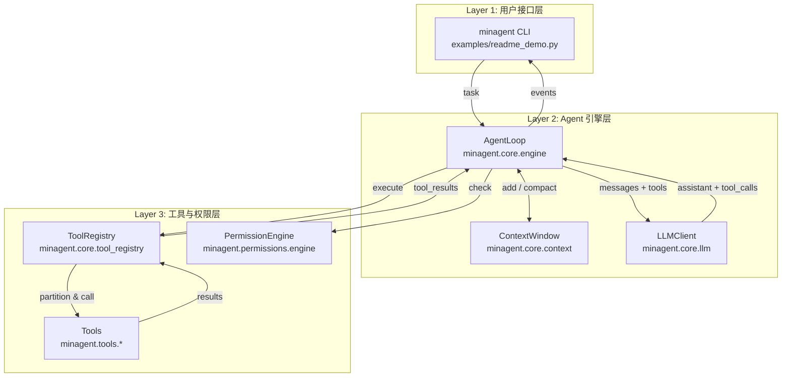
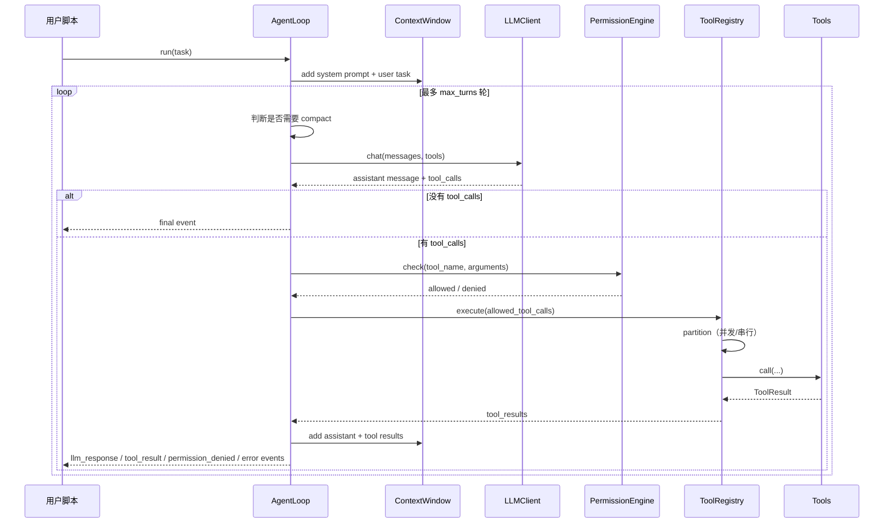

# minagent 架构设计文档

> **版本**: 0.1.0  
> **最后更新**: 2026-07-01  
> **关联文档**: [模块设计](./MODULE_DESIGN.md)、[版本演进计划](./ROADMAP.md)

---

## 1. 设计目标与定位

`minagent` 是一个受 [Claude Code](https://code.claude.com/docs) 启发的**最小 Python Agent 框架**。它的核心目标不是替代 Claude Code，而是：

- **快速验证 Agent 思路**：几小时内跑通“自然语言任务 → 工具调用 → 结果输出”的闭环。
- **领域专用 Agent 的起点**：例如钻井工程代码分析、装备保障智能分析等垂直场景。
- **学习与实践**：帮助开发者理解 Agent Loop、工具编排、上下文管理、权限控制等核心概念。

### 1.1 边界

| 在范围内 | 不在范围内（当前版本） |
|---------|---------------------|
| 基于 OpenAI 兼容 API 的 function calling | 原生 IDE 插件 / GUI |
| 文件、Shell、搜索、任务列表等基础工具 | 完整的 MCP 生态 |
| 异步 Agent Loop + 事件流 | 生产级沙箱执行 |
| 基础权限规则引擎 | 基于 LLM 的自动风险分类器 |

---

## 2. 核心设计原则

设计 `minagent` 时参考了 Claude Code 的源码架构分析（见 `docs/references/05_Claude_Code_源码架构分析.md`）以及 Agentic AI 的通用模式（见 `docs/references/20260519_Agentic_AI_架构设计深度分析.md`），并提炼出以下原则：

1. **简单优先**：MVP 只保留最核心能力，避免过度抽象。
2. **工具优先**：Agent 的能力上限取决于工具的种类与质量。
3. **异步原生**：所有工具执行基于 `asyncio`，避免阻塞。
4. **可观测**：通过事件流（event stream）和日志，让每一步操作可见、可审计。
5. **权限内建**：从第一行代码开始就把权限检查放进 Agent Loop，而不是后期补丁。
6. **可扩展**：工具、LLM 客户端、权限引擎都通过接口抽象，便于替换。

---

## 3. 总体架构

`minagent` 采用经典的三层 Agent 架构：



### 3.1 各层职责

| 层级 | 模块 | 职责 |
|-----|------|------|
| UI 层 | `minagent.cli` | 提供 `minagent <script.py>` 入口，负责加载并执行用户脚本。 |
| 引擎层 | `minagent.core.engine` | `AgentLoop`：管理 LLM 调用与工具执行的多轮循环。 |
| 引擎层 | `minagent.core.llm` | `LLMClient`：封装 OpenAI 兼容 API，负责 `chat.completions`。 |
| 引擎层 | `minagent.core.context` | `ContextWindow` / `Message`：维护对话历史、token 估算、上下文压缩。 |
| 引擎层 | `minagent.core.tool_registry` | `ToolRegistry`：工具注册、schema 转换、并发/串行编排。 |
| 工具层 | `minagent.tools.*` | 文件读写、Shell 执行、代码搜索、任务列表等具体工具。 |
| 权限层 | `minagent.permissions.engine` | `PermissionEngine`：按规则判断工具调用是否允许。 |

---

## 4. 执行流程（ReAct 风格）

`AgentLoop.run(task)` 实现了 **ReAct（Reasoning + Acting）** 循环：



### 4.1 关键步骤说明

1. **准备上下文**：将 `system_prompt` 和用户任务加入 `ContextWindow`。
2. **上下文压缩**：当 `rough_token_count()` 超过阈值时，触发 `compact()`，保留 system 消息和最近 6 条消息。
3. **调用 LLM**：`LLMClient.chat()` 发送 `messages` + `tools`，使用 `httpx` 异步请求。
4. **解析响应**：提取 `content` 和 `tool_calls`。
5. **权限检查**：`PermissionEngine.check()` 根据 `tool` / `filesystem` / `shell` 规则判断是否允许。
6. **工具编排**：`ToolRegistry._partition_tool_calls()` 将 tool_calls 分成可并发和需串行的批次：
   - 只读工具（如 `FileRead`、`Grep`、`Glob`）默认并发。
   - 写入/破坏性工具（如 `FileWrite`、`FileEdit`、`Bash`）串行。
7. **结果回注**：将 `tool_results` 加入上下文，进入下一轮。

---

## 5. 上下文管理

上下文由 `ContextWindow` 维护，参考 Claude Code 的上下文管理理念：

- **System Prompt**：固定指令，例如“你是一个 helpful coding assistant”。
- **Conversation History**：用户消息、助手消息、工具结果。
- **Tool Definitions**：每轮都将当前可用工具的 schema 发给 LLM。

### 5.1 消息结构

```python
class Message(BaseModel):
    role: str
    content: Optional[str] = None
    tool_calls: Optional[List[Dict[str, Any]]] = None
    tool_call_id: Optional[str] = None
    name: Optional[str] = None
```

### 5.2 自动压缩

当 `rough_token_count() > max_tokens * 0.8` 时：

```python
def compact(self) -> None:
    system_msgs = [m for m in self.messages if m.role == "system"]
    recent = self.messages[-6:]
    self.messages = (
        system_msgs
        + [Message(role="user", content="[Earlier conversation was compacted]")]
        + recent
    )
```

当前实现是**简化版压缩**，未来版本会引入摘要生成（见 [ROADMAP](./ROADMAP.md)）。

---

## 6. 工具系统

工具是 Agent 与外部环境交互的接口。`minagent` 的工具系统包含四个核心概念：

### 6.1 工具基类

```python
class Tool(ABC):
    name: str = ""
    description: str = ""
    input_model: Type[BaseModel]
    output_model: Type[BaseModel] = ToolResult

    def to_openai_schema(self) -> Dict[str, Any]: ...
    def is_read_only(self, input: BaseModel) -> bool: ...
    def is_concurrency_safe(self, input: BaseModel) -> bool: ...
    @abstractmethod
    async def call(self, input: BaseModel, context: ToolContext) -> ToolResult: ...
```

### 6.2 工具注册表

`ToolRegistry` 负责：

- `register()` / `register_many()`：注册工具，保证名称唯一。
- `to_openai_schemas()`：生成 OpenAI function calling schema。
- `execute()`：按并发/串行策略执行 tool_calls。

### 6.3 并发与串行

```python
def _partition_tool_calls(self, tool_calls):
    for tc in tool_calls:
        parsed = input_model.model_validate(tc["function"].get("arguments", {}))
        is_concurrent = tool.is_concurrency_safe(parsed)
        # 相同并发性质的调用合并到一个批次
```

这是 Claude Code `toolOrchestration` 的简化实现：

- **只读工具并发执行**，提升效率。
- **写入工具串行执行**，避免竞态和冲突。

### 6.4 当前工具清单

| 工具 | 类型 | 读写 | 并发 |
|-----|------|------|------|
| `FileRead` | 文件 | 读 | ✅ |
| `FileWrite` | 文件 | 写 | ❌ |
| `FileEdit` | 文件 | 写 | ❌ |
| `Bash` | Shell | 视命令 | 视命令 |
| `Grep` | 搜索 | 读 | ✅ |
| `Glob` | 文件枚举 | 读 | ✅ |
| `TaskList` | 任务管理 | 写（add/done） | ❌ |

---

## 7. 权限系统

`PermissionEngine` 提供三级模式：

| 模式 | 说明 |
|-----|------|
| `ask` | 每次危险操作都询问（当前为演示自动通过）。 |
| `auto` | 安全操作自动允许，危险操作按规则判断。 |
| `full_auto` | 全部自动，仅用于可信环境。 |

### 7.1 规则类型

```python
@dataclass
class PermissionRule:
    action: str          # allow, deny, ask
    resource_type: str   # filesystem, shell, tool
    pattern: str
```

默认规则（`PermissionEngine.default()`）：

- 允许 `FileRead`、`Grep`、`Glob`。
- 询问 `FileWrite`、`FileEdit`、`Bash`、`TaskList`。

### 7.2 匹配逻辑

- `tool` 规则：使用 `fnmatch` 匹配工具名。
- `filesystem` 规则：解析参数中的 `file_path` / `path`，按路径模式匹配。
- `shell` 规则：使用正则匹配命令字符串。

---

## 8. 可观测性

### 8.1 事件流

`AgentLoop.run()` 是异步生成器，产生以下事件：

| 事件类型 | 说明 |
|---------|------|
| `user_task` | 用户任务 |
| `llm_response` | LLM 响应（含 content、tool_calls、usage） |
| `tool_result` | 工具执行结果 |
| `permission_denied` | 权限被拒绝 |
| `compact` | 上下文被压缩 |
| `error` | 错误（全部工具被拒、达到最大轮数等） |
| `final` | 最终答案 |

用户脚本（如 `examples/readme_demo.py`）通过 `async for event in agent.run(task)` 消费事件并渲染。

### 8.2 日志

使用 `loguru` 记录关键节点：

- 每轮调用 LLM 前：`Turn X/Y: calling LLM (model=...)`
- LLM 请求信息：URL、模型、超时时间
- LLM 响应状态码
- 工具执行数量

日志级别可通过环境变量控制：

```bash
$env:MINAGENT_LOG_LEVEL="WARNING"   # PowerShell
export MINAGENT_LOG_LEVEL=WARNING    # Unix
```

---

## 9. 扩展性设计

### 9.1 添加自定义工具

只需继承 `Tool` 并实现 `call()`：

```python
from minagent.tools.base import Tool, ToolContext, ToolResult
from pydantic import BaseModel, Field

class MyInput(BaseModel):
    param: str = Field(..., description="...")

class MyTool(Tool):
    name = "MyTool"
    description = "..."
    input_model = MyInput

    def is_read_only(self, input: MyInput) -> bool:
        return True

    async def call(self, input: MyInput, context: ToolContext) -> ToolResult:
        return ToolResult.ok(f"result for {input.param}")
```

然后注册到 `ToolRegistry` 即可。

### 9.2 替换 LLM 客户端

当前 `LLMClient` 基于 OpenAI 兼容 API。后续可通过抽象接口支持 Anthropic、本地模型路由等（见 [ROADMAP](./ROADMAP.md)）。

### 9.3 未来方向

- **子 Agent（AgentTool）**：允许一个 Agent 调用另一个 Agent 完成子任务。
- **MCP 支持**：通过 Model Context Protocol 接入外部工具服务器。
- **Skill 系统**：按项目/领域加载自定义 prompt 和工具组合。

---

## 10. 与 Claude Code 的对比

| 维度 | Claude Code | minagent (v0.1.0) |
|------|-------------|-------------------|
| 形态 | 终端 TUI | Python 库 + CLI |
| 代码量 | 1,300+ 源码文件 | ~700 行 Python |
| UI | Ink/React 实时渲染 | 事件流 + 日志 |
| 工具 | 非常丰富（LSP、MCP、Git、Web 等） | 基础文件/Shell/搜索 |
| 权限 | 多层分类器 + 对话框 | 规则引擎（简化版） |
| 上下文 | 高级 compact + 缓存 | 基础 compact + token 估算 |
| 适用场景 | 生产级复杂任务 | 快速验证、教学、领域 Agent 起点 |

`minagent` 的核心价值是**把 Claude Code 的工程思想浓缩成最小可运行的 Python 框架**，让开发者能在此基础上快速迭代。

---

## 11. 关键设计教训

1. **工具优先于提示词**：工具的种类和质量决定 Agent 上限。
2. **权限系统必须内建**：从第一天开始设计，而不是后期补丁。
3. **只读并发、写入串行**：这是效率与安全的平衡。
4. **上下文管理是核心**：没有好的上下文管理，Agent 无法处理真实项目。
5. **可观测性不是可选**：每一步操作都要能被用户看到和审计。
6. **错误处理要详尽**：工具失败、API 失败、超时、权限拒绝都要处理。

---

*参考：`docs/references/04_Claude_Code_代码分析实战指南.md`、`docs/references/05_Claude_Code_源码架构分析.md`、`docs/references/20260519_Agentic_AI_架构设计深度分析.md`*
